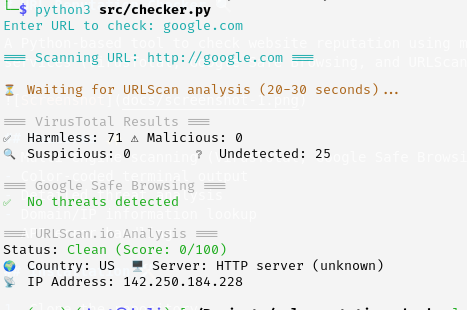
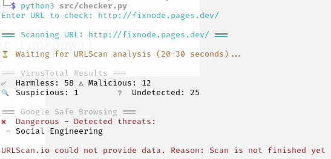

# URL Reputation Checker 🔍

A Python-based tool to check URL reputation using multiple API (VirusTotal, Google Safe Browsing, and URLScan.io).

## Features ✨
- Multi-engine scanning (VirusTotal, Google Safe Browsing, URLScan.io)
- Color-coded terminal output
- Detailed threat analysis
- Domain/IP information lookup
- API error handling

## Installation 🛠️

1. Clone the repository:
```bash
git clone https://github.com/<your-username>/url-reputation-checker.git
cd url-reputation-checker
```

2. Install dependencies:
```bash
pip install -r requirements.txt

```

3. Create .env file:
```bash
VIRUSTOTAL_API_KEY="your_virustotal_api_key"
GOOGLE_SAFEBROWSING_API_KEY="your_google_api_key"
URLSCAN_API_KEY="your_urlscan_api_key"
```

## Usage 🚀
```bash
python src/checker.py
```

## Example Output





##Acknowledgments 🙏
VirusTotal API
Google Safe Browsing API
URLScan.io API
